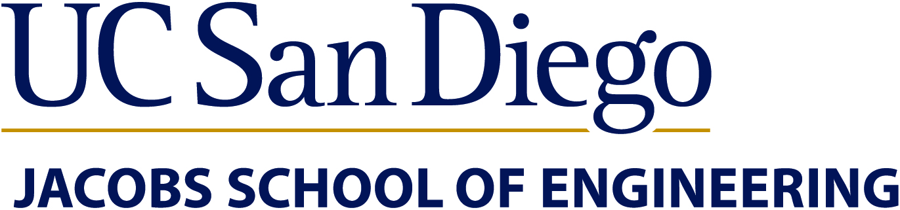
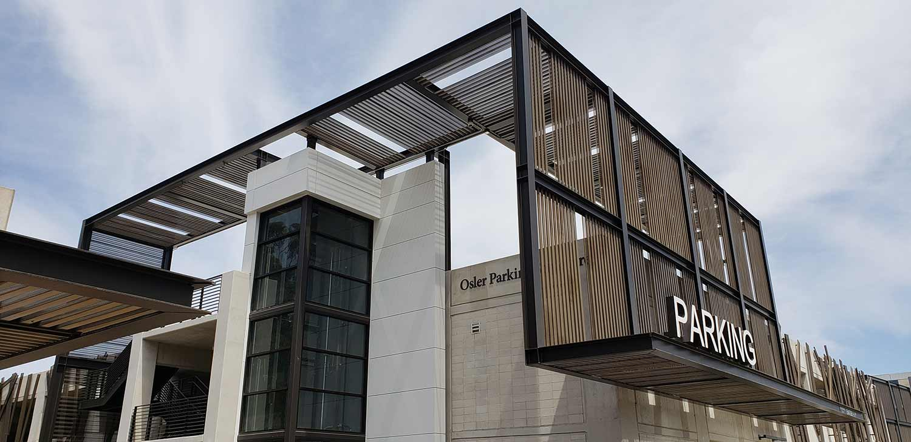

<link href="https://fonts.googleapis.com/css2?family=Roboto&display=swap" rel="stylesheet">

<nav style="background-color: white; padding: 1em;">
  <a href="/ECE196_team10/" style="color:#000; margin-right: 15px; text-decoration: underline;">Home</a>
  <a href="/ECE196_team10/problem" style="color:#000; margin-right: 15px; text-decoration: underline;">The Problem</a>
  <a href="/ECE196_team10/solution" style="color: #000; margin-right: 15px; text-decoration: underline;">Our Solution</a>
  <a href="/ECE196_team10/milestones_progress" style="color:#000; margin-right: 15px; text-decoration: underline;"> Milestones and Progress </a>
  <a href="/ECE196_team10/pcb" style="color:#000;margin-right: 15px;  text-decoration: underline;">Our PCB</a>
  <a href="/ECE196_team10/team" style="color:#000; margin-right: 15px; text-decoration: underline;">About Us</a>
  <a href="ECE196_team10/application_website_GPF/index.html" style="color:#000; margin-right: 15px; text-decoration: underline;">Our Application</a>
</nav>

# ECE 196 Spring 25 Team 10: Improving the Student Parking Experience

Welcome to our team's website! We are interested in improving the UCSD student experience of parking for class on campus. For more information about this project, please refer to the links above.Also Our project helps UCSD students find parking more easily by combining ultrasonic sensors with Bluetooth communication to detect spot occupancy in real time. Data is sent to a live dashboard that shows current parking availability, making campus commuting more efficient.

