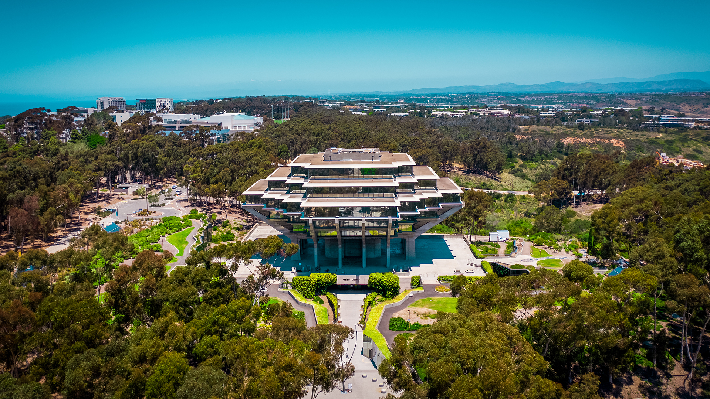

# ECE 196 Team 10: Improving the Student Parking Experience

Welcome to our team's website! We are interested in improving student experiences with parking for class. For more information on our problem focus, or about us, please see the links below.

### [What is the Problem?](https://aap127.github.io/ECE196_team10/problem)

### [How to solve it](https://aap127.github.io/ECE196_team10/solution)

### [Our PCB](https://aap127.github.io/ECE196_team10/pcb)

### [Our Progress/ Updates](https://aap127.github.io/ECE196_team10/progress) (Week 6 Progress Report Included)

### [About the Team](https://aap127.github.io/ECE196_team10/team)

