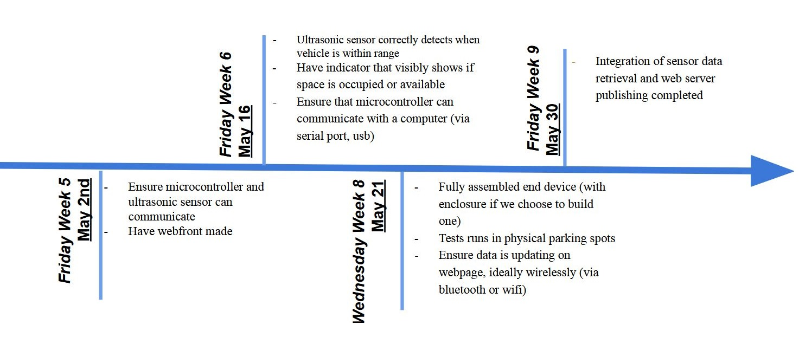

<nav style="background-color: white; padding: 1em;">
  <a href="/" style="color:#000; margin-right: 15px; text-decoration: underline;">Home</a>
  <a href="/problem" style="color:#000; margin-right: 15px; text-decoration: underline;">The Problem</a>
  <a href="/solution" style="color: #000; margin-right: 15px; text-decoration: underline;">Our Solution</a>
  <a href="/milestones_progress" style="color:#000; margin-right: 15px; text-decoration: underline;"> Milestones and Progress </a>
  <a href="/pcb" style="color:#000;margin-right: 15px;  text-decoration: underline;">Our PCB</a>
  <a href="/team" style="color:#000; margin-right: 15px; text-decoration: underline;">About Us</a>
</nav>

# Our Milestones and Progress

## Our Milestones

## Updates

## Some development updates/ challenges
- In the development process, we have had to resort to our original ultrasonic sensors (HC-SR04), 
as the waterproof ones we purchased for robustness (JSN-SR04) do not appear to communicate correctly in our setup.

- Our HC-SR04 sensor claims to operate at 3.3V, however we found that it would not correctly report distance at this voltage.
As such, we will need to modify our PCB to pull sensor power from 5V. 
We will also need to use a logic level shifter to convert signals from the sensors to be 3.3V high level logic to be read by our ESP32 mini.

### Week 6 Updates:

Website: Our website has a home page with seperated sections as required.

Poster: Our poster draft can be found [here](https://docs.google.com/presentation/d/1rFXBSj3DbrjLsAPUIrnIcoYYUYrfbvTKr-7pOcrXOec/edit?usp=sharing)

Video:

- We have identified that Davinchi Resolve is a free video editing software we should be able to use in video creation.
- Our brainstorming document link can be found [here](https://docs.google.com/document/d/10_ftLWyBoUnVmPoIE4VHaFJpjuLpyQf4ek2ec_xqJh0/edit?usp=sharing) 