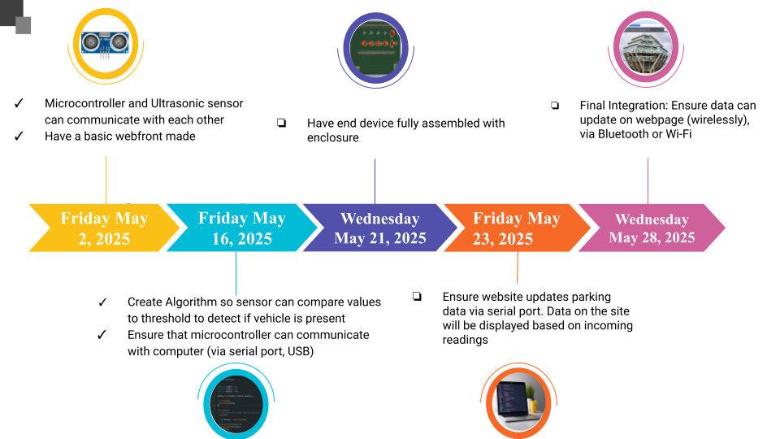
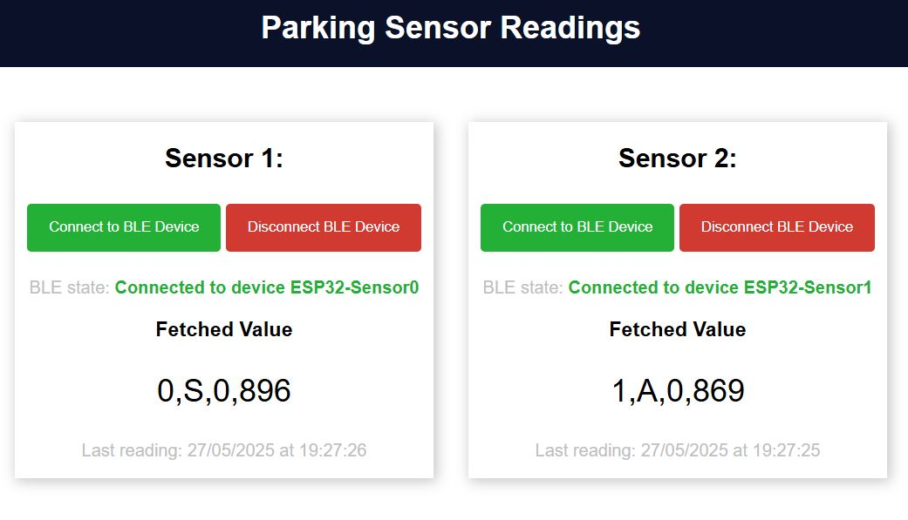
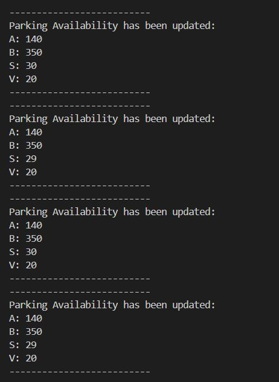
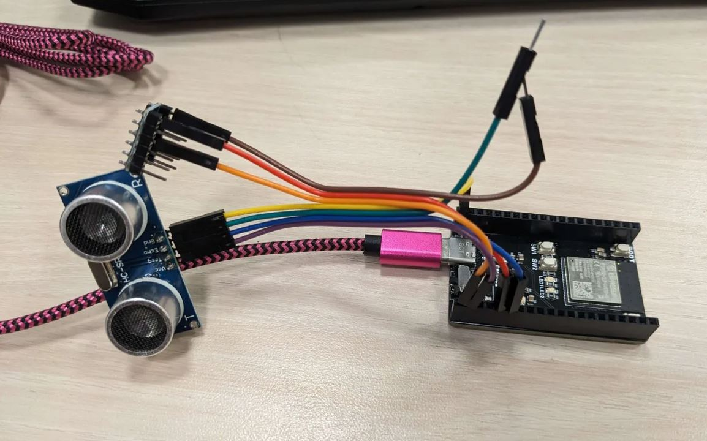
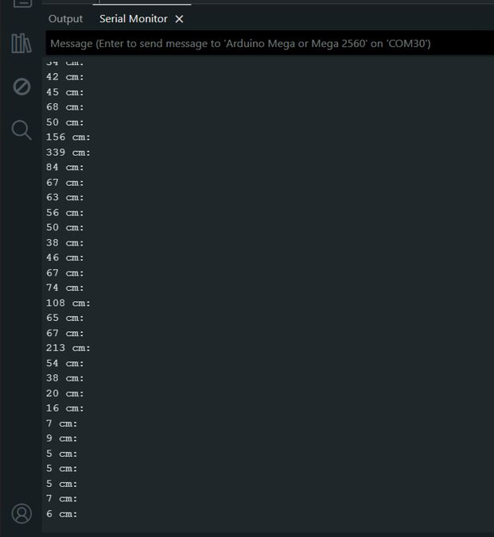
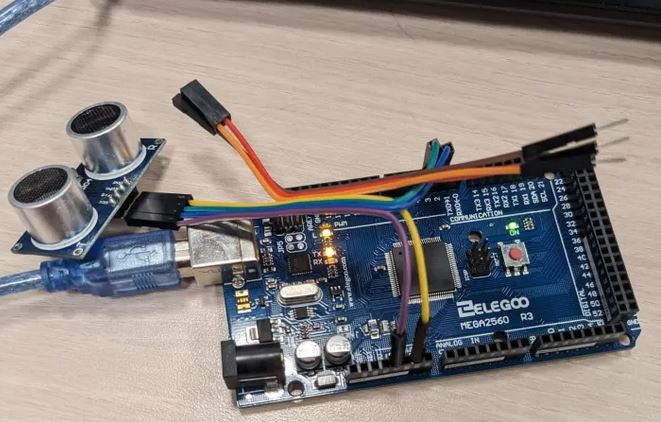

<link href="https://fonts.googleapis.com/css2?family=Roboto&display=swap" rel="stylesheet">

<nav style="background-color: white; padding: 1em;">
  <a href="/ECE196_team10/" style="color:#000; margin-right: 15px; text-decoration: underline;">Home</a>
  <a href="/ECE196_team10/problem" style="color:#000; margin-right: 15px; text-decoration: underline;">The Problem</a>
  <a href="/ECE196_team10/solution" style="color: #000; margin-right: 15px; text-decoration: underline;">Our Solution</a>
  <a href="/ECE196_team10/milestones_progress" style="color:#000; margin-right: 15px; text-decoration: underline;"> Milestones and Progress </a>
  <a href="/ECE196_team10/pcb" style="color:#000;margin-right: 15px;  text-decoration: underline;">Our PCB</a>
  <a href="/ECE196_team10/team" style="color:#000; margin-right: 15px; text-decoration: underline;">About Us</a>
</nav>

# Our Milestones and Progress
This page contains our milestones and project progress. Additionally, the progress of our presentation materials- this includes our website, poster, and video, can be found below.

## Milestones

## Project Updates

#### Week 9

#### Week 8
- While we did not finish out enclosure, we began deciding the shape of it and narrowing down the design constrains on it, including how it should look, what spacing we should have, etc.
- We tested bluetooth communication, and were able to use multiple ESP's in order to update a test webpage.

<small>*Example of two sensors simultaneously sending data to a website with near-realtime updates (around every 3 seconds).</small>

#### Week 7
- We created our device algorithm to mark a spot as detected. At a high level, it cosists of using an average of detections over the last second to smooth out any extraneous values the sensor may pick up.
- We created an example python pipeline to read sensor values and display changes in parking data. Now that we have gotten the device's reported data into a language via serial, we are ready to attempt to expand to wireless communication.
  

#### Week 6
- We spent time this week brainstorming how to modify our PCB, given the issues posed by the ultrasonic sensors not working with 3.3V. We ultimately decided to order logic level shifters to convert between 3.3V and 5V, ensuring that the HC-SR04 output is recieved as 3.3V level high. An image of this modified setup can be seen below; note that this setup is now able to use the ESP-32 vs an Arduino due to the level shifter.
- Challenges:
  -  We ordered waterproof JSN-SR04 sensors which did not correctly report distance. We spent a large portion of time debugging this, ultimately setting our progress back. As such, and combined with the time spent brainstorming for our PCB, our milestone timeline was pushed back one week to accomodate for testing sensor detection later on.
  

#### Week 5: 
- We created our webfront which we can later add our parking availability metrics to for users. We also got the HC-SR04 ultrasonic sensors to communicate with the computer via serial monitor in Arduino IDE. Images of both can bee seen below.
- Challenges: 
  - We realized the HC-SR04 sensors, despite advertising the ability to work with 3.3V input voltage, were unreliable or just not working. This means we will need to modify our PCB to pull power from the 5V header of the ESP-32. 

## Final Presentation Updates

#### Week 8:
Website: The required sections of the website can be seen here on on the various other pages of this site.

Poster: [Link](https://docs.google.com/presentation/d/1rFXBSj3DbrjLsAPUIrnIcoYYUYrfbvTKr-7pOcrXOec/edit?usp=sharing)

Video Outline: [Link](https://docs.google.com/document/d/10_ftLWyBoUnVmPoIE4VHaFJpjuLpyQf4ek2ec_xqJh0/edit?usp=sharing)

#### Week 6:

Website: Our website has a home page with seperated sections as required.

Poster: Our poster draft can be found [here](https://docs.google.com/presentation/d/1rFXBSj3DbrjLsAPUIrnIcoYYUYrfbvTKr-7pOcrXOec/edit?usp=sharing)

Video:

- We have identified that Davinchi Resolve is a free video editing software we should be able to use in video creation.
- Our brainstorming document link can be found [here](https://docs.google.com/document/d/10_ftLWyBoUnVmPoIE4VHaFJpjuLpyQf4ek2ec_xqJh0/edit?usp=sharing) 