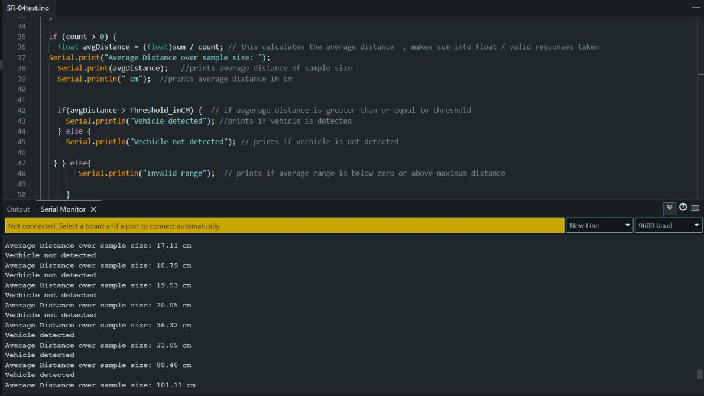
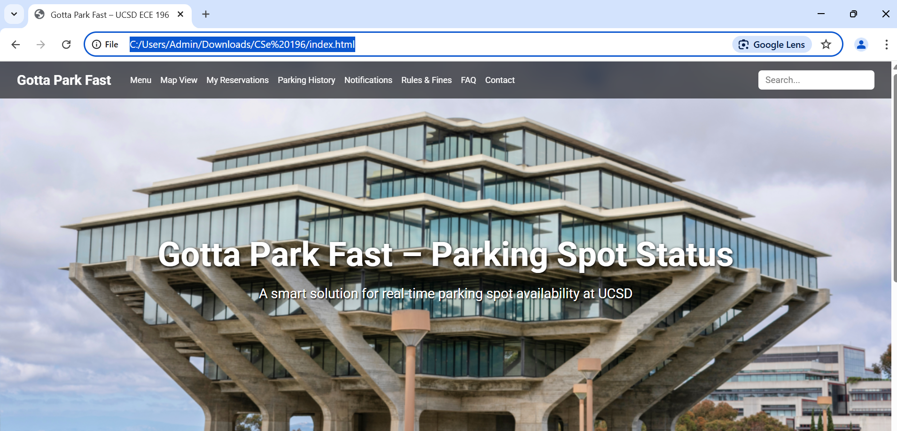

  <link href="https://fonts.googleapis.com/css2?family=Roboto&display=swap" rel="stylesheet">

<nav style="background-color: rgb(200, 232, 242); padding: 1em;">

  <a href="/ECE196_team10/" style="color:#000; margin-right: 15px; text-decoration: underline;">Home</a>
  <a href="/ECE196_team10/problem" style="color:#000; margin-right: 15px; text-decoration: underline;">The Problem</a>
  <a href="/ECE196_team10/solution" style="color: #000; margin-right: 15px; text-decoration: underline;">Our Solution</a>
  <a href="/ECE196_team10/milestones_progress" style="color:#000; margin-right: 15px; text-decoration: underline;"> Milestones and Progress </a>
  <a href="/ECE196_team10/pcb" style="color:#000;margin-right: 15px;  text-decoration: underline;">Our PCB</a>
  <a href="https://docs.google.com/presentation/d/1rFXBSj3DbrjLsAPUIrnIcoYYUYrfbvTKr-7pOcrXOec/edit?usp=sharing" style="color:#000;margin-right: 15px;  text-decoration: underline;">Poster</a>
  <a href="https://drive.google.com/file/d/1jj1QcZ62BZAWAesPke6ln_tHwNwHV5pS/view?usp=sharing" style="color:#000;margin-right: 15px;  text-decoration: underline;">Video</a>
  <a href="https://aap127.github.io/ECE196_team10/team#mini-projects-3-tutorials" style="color:#000;margin-right: 15px;  text-decoration: underline;">Mini Project Tutorials</a>
  <a href="/ECE196_team10/team" style="color:#000; margin-right: 15px; text-decoration: underline;">About Us</a>
  <a href="/ECE196_team10/application_website_GPF/index.html" style="color:#000; margin-right: 15px; text-decoration: underline;">Our Application</a>
</nav>

# Our Milestones and Progress
This page contains our milestones and project progress from during the project's duration, along with limitations and considerations for a real deployment, which our team identified after the project. Additionally, the progress of our presentation materials- this includes our website, poster, and video, can be found below.

## Final Limitations/ Considerations for Deployment

<u>Sensing:</u>

The HC-SR04 ultrasonic sensor is an afforable solution and performed reasonably well for our project's needs, including detection of a real car. With this said, consideration of other, potentially more robust, ultrasonic sensors would help ensure inmproved durability and reliability. Our team did try to consider the usage of a more advanced JSN-SR04 sensor, however (as noted below in our week 6 update) the units we recieved unfortunately would not correctly report distance.

 Beyond ultrasonic sensing, consideration of other sensing methods, such as time-of-flight, could also be used to more thouroughly compare what may ultimately work best.

<u> Connection Protocol/ Networking Setup:</u>

Our current setup uses Bluetooth-Low-Energy (BLE) to connect the ESP32-sensor devices to the computer dashboard. In a real deployment, the number of devices connected per computer server could potentially become an issue, either requiring many computer servers, or potentially a different networking protocol. Alternative protocols could include Wi-Fi or 802.15.4 for more mesh-style networking. It is worth noting that changes could need to be made to the microcontroller setup, as the ESP-32 S3 Dev Modules we used support BLE and Wi-fi.

It is also worth considering a wired data transfer setup, to reduce congestion over the air. This may not be too impractical, given that the microntrollers will also need wiring to supply power, unless a battery system is used instead.

<u>Database/ Web Distribution:</u>

Our team relied on Google Firebase to store our parking information reported by the dashboard. Parking services or the group responsible for this deployment may ultimately want to create a database on-site, or make other considerations, epsecially as more live traffic flows through the database and if they consider parking data to be confidential.

Additionally, switching to a UCSD hosted or other hosting domain may ensure no issues with the amount of student/ user traffic to the main website, as the current site is hosted on github pages.

## Milestones

## Project Updates
Click [here](#week-5) or scroll down to read about our progress.

#### Week 10
- We finished our full data collection and distribution pipeline. The sensors connect to a computer dashboard, which updates a database. Ultimately, our website displays this updated information. The device itself also shows physical LED indicators for on site status viewing.
- A demonstration of reporting a spot's availability with a real car in our team's [video](https://drive.google.com/file/d/1jj1QcZ62BZAWAesPke6ln_tHwNwHV5pS/view?usp=sharing) (skip to 3:00 for live demo)

<video width="1064" height="600" controls> <source src="source/milestones_updates/integration.mp4" type="video/mp4"> </video>
\* An example of the sensor operating as a visitor spot parking detector

#### Week 9
- We successfully printed and assembled an <strong>enclosure</strong> for our device
- We assembled first prototype PCB, making wiring additions for the logic level shifter as needed.
- We implemented a <strong>Google Firebase database</strong> in between the computer server and webfront for real time data updates and distribution. This involved assigning one offline webpage to be a <u>dashboard</u> to connect to the sensors and database, and the main page to <u>distribute</u> the information.
- Real-time parking data transfer from the device to the website via Bluetooth is still being finalized.

#### Week 8
- While we did not finish our enclosure, we began deciding the shape of it and narrowing down the design constrains on it, including how it should look, what spacing we should have, etc.
- We also decided to abandon trying to update the website via serial, as we wanted to focus our attention to wireless communication, rather than making two communication methods.
- We tested bluetooth communication, and were able to use multiple ESP's in order to <u>update a test webpage</u>.

<small>*Example of two sensors simultaneously sending data to a website with near-realtime updates (around every 3 seconds).</small>

#### Week 7
- We created our <strong>device algorithm</strong> to mark a spot as detected. At a high level, it cosists of using an average of detections over the last second to smooth out any extraneous values the sensor may pick up.
- We created an <u>example python pipeline</u> to read sensor values and display changes in parking data. Now that we have gotten the device's reported data into a language via serial, we are ready to attempt to expand to wireless communication.
  

<small>\* This plot shows the raw distance that the sensor reads (blue) and the averaged value from our algorithm (orange). It first simulates an object approaching the sensor (such as a car), then leaving. Average distance is compared to the detection threshold (red) to determine occupancy of the parking spot. The raw sensor data can occasionally be inconsistent with peaks and dips, however the average value smooths out these changes, allowing parking detection to be less sporadic and more controlled.</small>

#### Week 6
- We spent time this week brainstorming <u>how to modify our PCB</u>, given the issues posed by the ultrasonic sensors not working with 3.3V. We ultimately decided to order <strong>logic level shifters</strong> to convert between 3.3V and 5V, ensuring that the HC-SR04 output is recieved as 3.3V level high. An image of this modified setup can be seen below; note that this setup is now able to use the ESP-32 vs an Arduino due to the level shifter.
- Challenges:
  -  We ordered waterproof JSN-SR04 sensors which did <u>not correctly report distance</u>. We spent a large portion of time debugging this, ultimately setting our progress back. As such, and combined with the time spent brainstorming for our PCB, our milestone timeline was pushed back one week to accomodate for testing sensor detection later on.
  

#### Week 5: 
- We created our <strong>webfront</strong> which we can later add our parking availability metrics to for users. We also got the HC-SR04 ultrasonic sensors to communicate with the computer via <strong>serial monitor</strong> in Arduino IDE. Images of both can bee seen below.
- Challenges: 
  - We realized the HC-SR04 sensors, despite advertising the ability to do so, were <u>unreliable or just not working when supplied with 3.3V input</u>. This means we will need to modify our PCB to pull power from the 5V header of the ESP-32. 

## Final Presentation Updates

#### Week 8:
Website: The required sections of the website can be seen here on on the various other pages of this site.

Poster: [Link](https://docs.google.com/presentation/d/1rFXBSj3DbrjLsAPUIrnIcoYYUYrfbvTKr-7pOcrXOec/edit?usp=sharing)

Video Outline: [Link](https://docs.google.com/document/d/10_ftLWyBoUnVmPoIE4VHaFJpjuLpyQf4ek2ec_xqJh0/edit?usp=sharing)

#### Week 6:

Website: Our website has a home page with seperated sections as required.

Poster: Our poster draft can be found [here](https://docs.google.com/presentation/d/1rFXBSj3DbrjLsAPUIrnIcoYYUYrfbvTKr-7pOcrXOec/edit?usp=sharing)

Video:

- We have identified that Davinchi Resolve is a free video editing software we should be able to use in video creation.
- Our brainstorming document link can be found [here](https://docs.google.com/document/d/10_ftLWyBoUnVmPoIE4VHaFJpjuLpyQf4ek2ec_xqJh0/edit?usp=sharing) 
