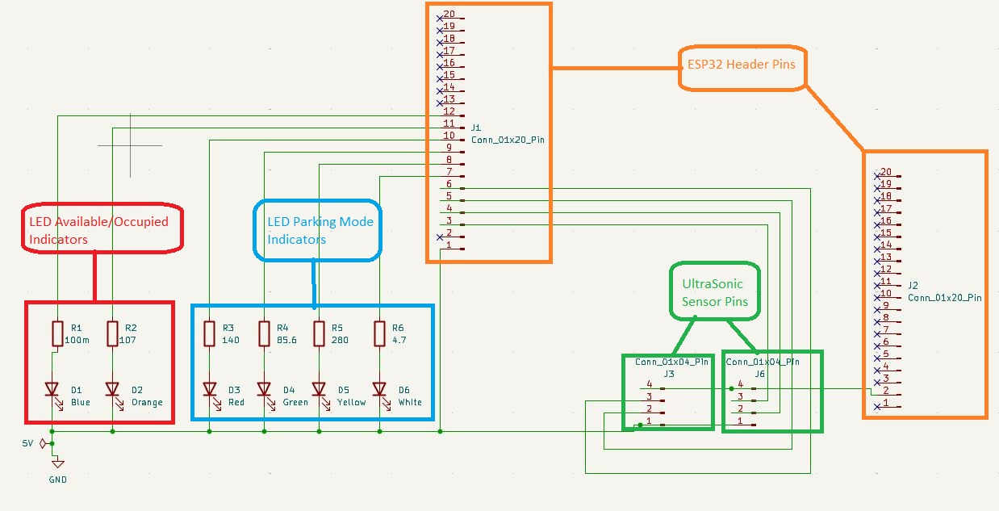
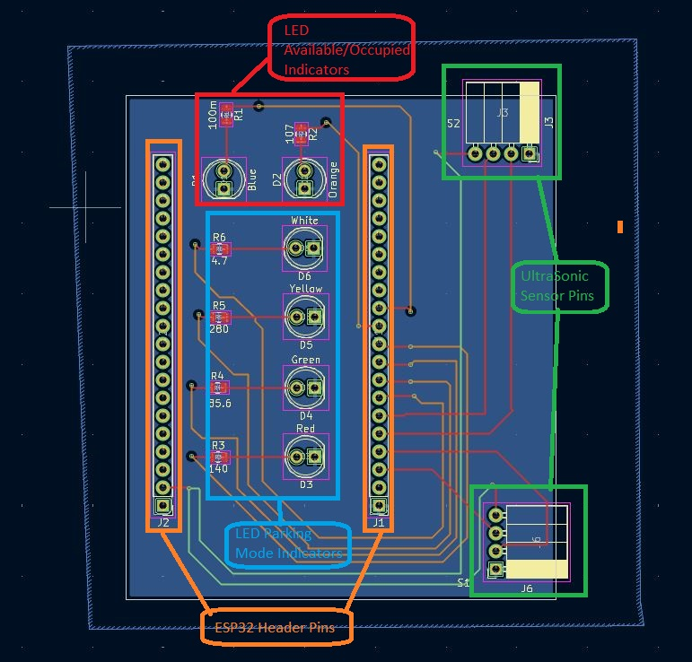
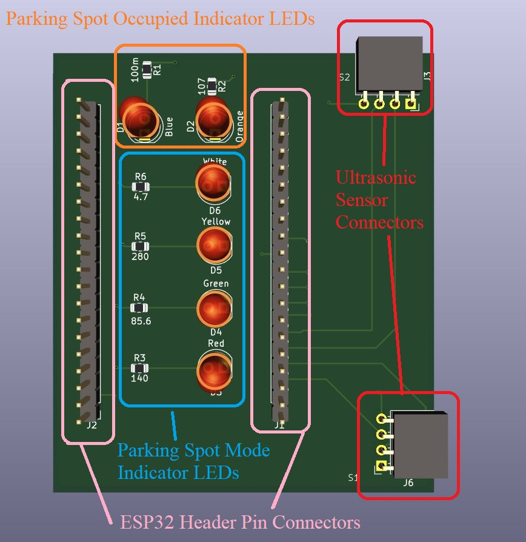

# Our PCB Design

## Overview/ Explaination

We have created a 4 layer PCB board to support a smart parking indicator system, 
centered around an ESP32-Mini microcontroller that will be used to communicate with a website. 
It features dual-row header pins (J1 and J2) to connect the ESP32 to all the seen components. 
Four LEDs with resistors labeled R3-R6 serve as parking mode indicators; they indicate if the device is reporting for an A, B, S, or V spot. 
The other two LEDs with resistors labeled R1 and R2 show real-time availability. Two 4-pin connectors (J3 and J6) will support 
HC-SR04 ultrasonic sensors to detect vehicle presence. Power and ground are routed from the ESP32 through the board to supply all components. 
 

## Wiring Schematic

## PCB Schematic and Diagram

## Some development updates/ challenges
- In the development process, we have had to resort to our original ultrasonic sensors (HC-SR04), 
as the waterproof ones we purchased for robustness (JSN-SR04) do not appear to communicate correctly in our setup.

- Our HC-SR04 sensor claims to operate at 3.3V, however we found that it would not correctly report distance at this voltage.
As such, we will need to modify our PCB to pull sensor power from 5V. 
We will also need to use a logic level shifter to convert signals from the sensors to be 3.3V high level logic to be read by our ESP32 mini.