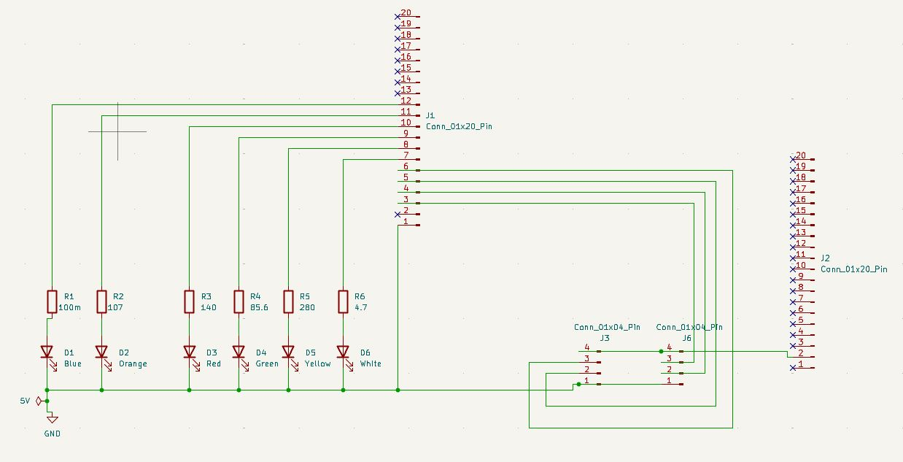
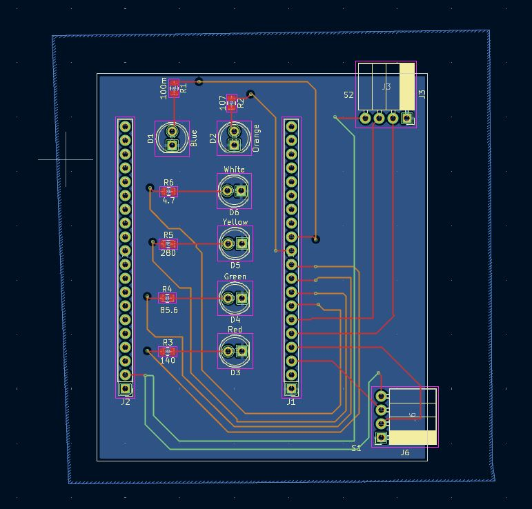

# Our PCB Design

## Overview/ Explaination
In the PCB schematic below, 

## Wiring Schematic

## PCB Schematic and Diagram

### The PCB has the following components:
- **Connectors for ultrasonic sensors:** Connects the sensors to the PCB
- **Spot occupied indicator LEDs:** Indicates if the spot is either taken or not taken with seperately colored LEDs
- **Spot mode indicator LEDs**: Inidcates the mode the device is set up for (i.e. whether it is reporting space availability for an A,B, S, or V parking spot)
- **ESP32 Connector Pins:** Enables the PCB to interface with the ESP32 mini microcontroller
