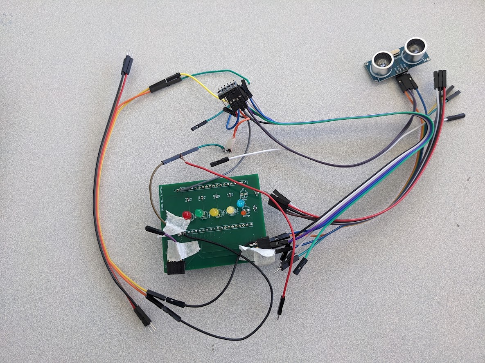

<nav style="background-color: white; padding: 1em;">
  <a href="/ECE196_team10/" style="color:#000; margin-right: 15px; text-decoration: underline;">Home</a>
  <a href="/ECE196_team10/problem" style="color:#000; margin-right: 15px; text-decoration: underline;">The Problem</a>
  <a href="/ECE196_team10/solution" style="color: #000; margin-right: 15px; text-decoration: underline;">Our Solution</a>
  <a href="/ECE196_team10/milestones_progress" style="color:#000; margin-right: 15px; text-decoration: underline;"> Milestones and Progress </a>
  <a href="/ECE196_team10/pcb" style="color:#000;margin-right: 15px;  text-decoration: underline;">Our PCB</a>
  <a href="/ECE196_team10/team" style="color:#000; margin-right: 15px; text-decoration: underline;">About Us</a>
</nav>

# Our PCB Design

## Overview/ Explaination

We have created a 4 layer PCB board to support our smart parking indicator system with the following key highlights:

- It is centered around an **ESP32-Mini microcontroller** that will be used to communicate with our website. 

- It features **dual-row header pins** (J1 and J2) to connect to the ESP32 .

- Four LEDs with resistors labeled R3-R6 serve as **parking mode indicators**. They indicate if the device is reporting for an A, B, S, or V spot. 

- The other two LEDs with resistors labeled R1 and R2 show **real-time availability** (i.e. if the spot is detected as occupied or not). 
  
- Two 4-pin connectors (J3 and J6) will support  **HC-SR04 ultrasonic sensors** to detect vehicle presence. 
  
- **Power and ground** are routed from the ESP32 through the board to supply all components. 
 

## Board Development

### 1. Wiring Schematic

### 2. PCB Schematic and Diagram

### 3. Physical Board

### 4. Assembled Board

## Design Challenges/ Pivots

Our board initially was designed to run the ultrasonic sensors off of 3.3V supply voltage (as opposed to 5V), as our ESP-32 would then be able to accept the signals.

After our board was finalized and ordered, our team determined that our ultrasonic sensors, despite advertising and the datasheet, did not function correctly when supplied with 3.3V input. Due to this, we had to pivot our design to include a logic level shifter. This allows the ESP-32, which uses 3.3V to represent a HIGH signal, to communicate with the sensor, which uses 5V for its signals.

As seen in the image above, the setup uses additional wiring for the signals and reference voltages for the logic level shifter. This allows us to recieve the send and recieve the correct signals which the ESP-32 is able to use.