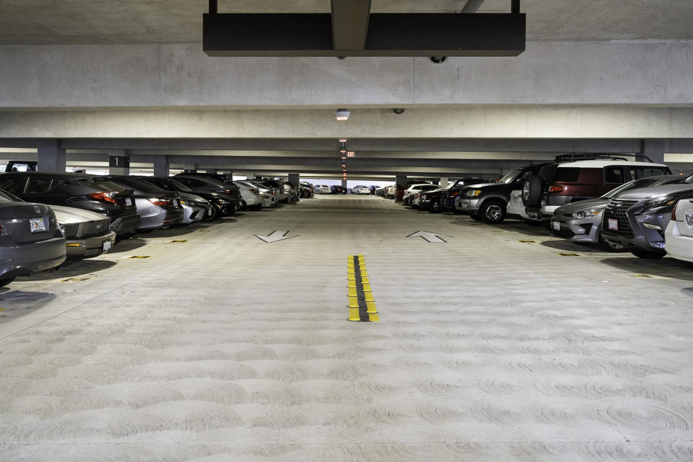

# Our Focus

## The Problem:

As a student, it can be difficult to find parking for classes, especially during congested times of the day. This is true for students using campus parking structures, along with those parking in transit center parking to commute via trolley.

*Photo credit to The UCSD Guardian (https://ucsdguardian.org/2024/02/05/the-parking-problem/)

## Our Motivation:

The team chose to tackle this issue because it is a recurring problem that affects both students and faculty, often leading to negative consequences. These include wasted time and the need to park in illegal spaces-- resulting in the risk of recieving overpriced parking tickets. This challenge also extends beyond on-campus parking and includes many public parking strutures. Our motivation comes from not only how common this issue is, but also from experiencing it ourselves. By tackling this problem, we aim to create a solution that improves campus life for students and faculty.

## Current Solutions:

Although parking sensors have already been implemented, they are not functioning as intended. Specifically, the number of available spots displayed does not accurately reflect the actual availability on each parking level. In some cases, the system shows a green light indicating an open space, even when the spot is already occupied. Ensuring the sensors operate as designed would greatly improve parking accuracy and reduce confusion for drivers.

