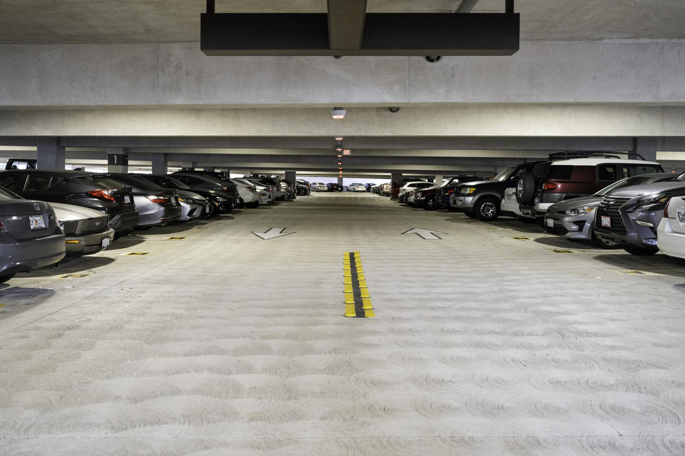
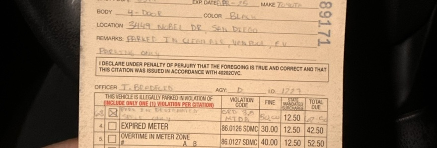
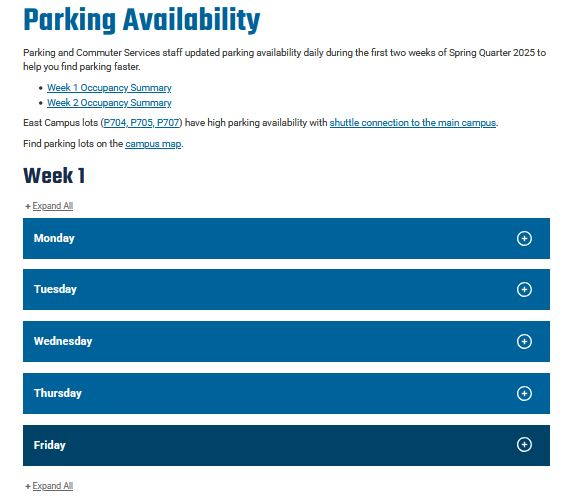
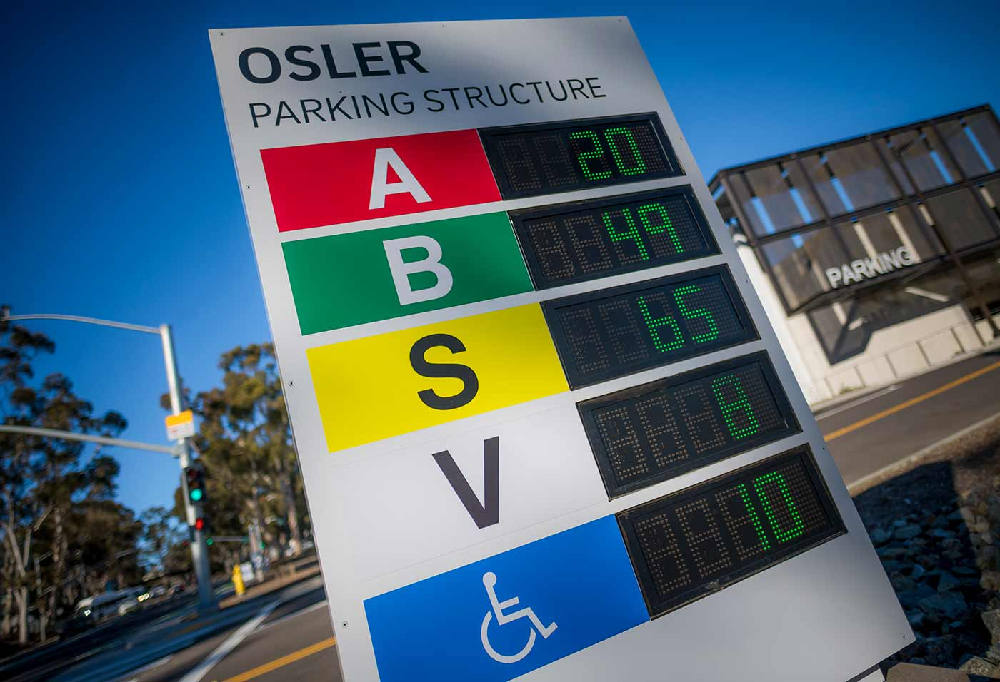
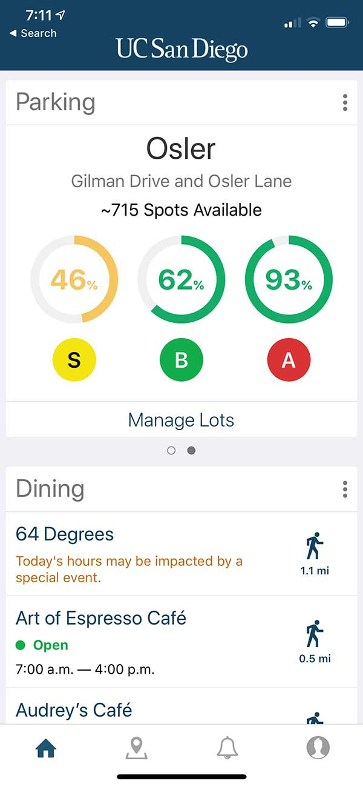
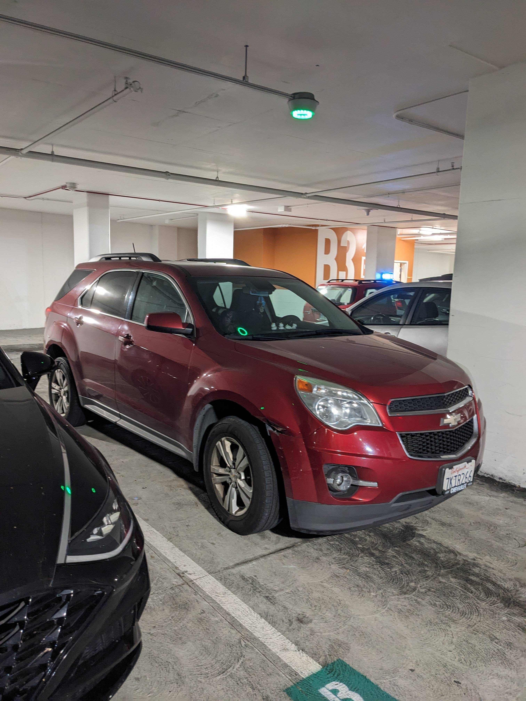
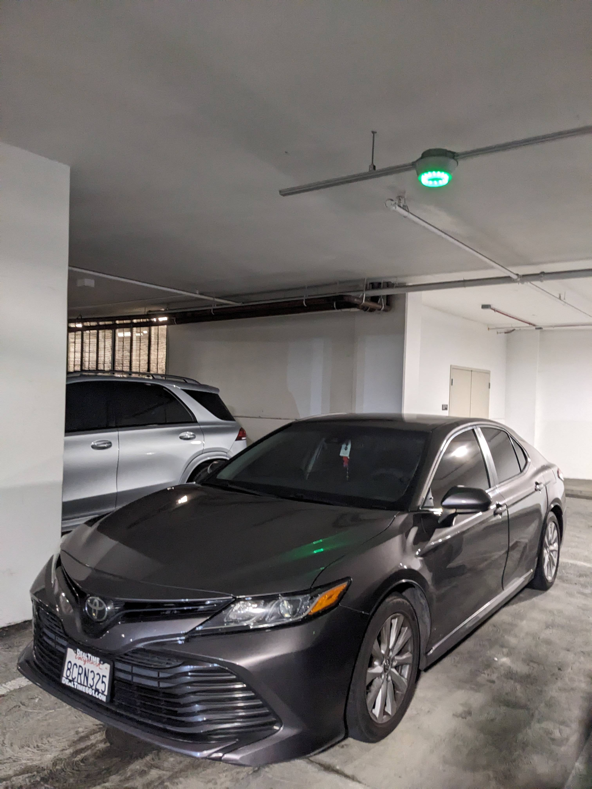

<nav style="background-color: white; padding: 1em;">
  <a href="/" style="color:#000; margin-right: 15px; text-decoration: underline;">Home</a>
  <a href="/problem" style="color:#000; margin-right: 15px; text-decoration: underline;">The Problem</a>
  <a href="/solution" style="color: #000; margin-right: 15px; text-decoration: underline;">Our Solution</a>
  <a href="/milestones_progress" style="color:#000; margin-right: 15px; text-decoration: underline;"> Milestones and Progress </a>
  <a href="/pcb" style="color:#000;margin-right: 15px;  text-decoration: underline;">Our PCB</a>
  <a href="/team" style="color:#000; margin-right: 15px; text-decoration: underline;">About Us</a>
</nav>

# Our Focus

## The Problem:

As a student, it can be difficult to find parking for classes, especially during congested times of the day. This is especially true for students using campus parking structures. **Knowing how many spots are available gives better context for a student to understand where they might want to park, if they should show up to campus at all.**

<small>*Photo credit to The UCSD Guardian (https://ucsdguardian.org/2024/02/05/the-parking-problem/)</small>

## Our Motivation:

The team chose to tackle this issue because it is a recurring problem that affects both students and faculty, often leading to negative consequences. These include wasted time and the need to park in illegal spaces-- resulting in the risk of recieving overpriced parking tickets. This challenge also extends beyond on-campus parking and includes many public parking strutures. Our motivation comes from not only how common this issue is, but also from experiencing it ourselves. By tackling this problem, we aim to create a solution that improves campus life for students and faculty.

## Current Solutions:

#### <u>Information Distribution</u>:
Currently, to know where they should park, students have a few options:

* UCSD releases parking data collected during the first two weeks of each quarter, giving a rough estimate of demand. 

<small>*https://transportation.ucsd.edu/commute/availability.html</small>

* Students can view the displays outside the parking structure to see how many spots are reported to be available. However, this requires them to have already chosen to drive to campus.

<small>*Image credit: https://today.ucsd.edu/story/parking-on-campus-theres-an-app-for-that</small>

* The most robust option is the UCSD app, which reports the percentage of spot types (A,B,S, etc) available. The total estimated number of spots available is also reported. The main drawbacks are still requiring the usage of a phone, and not reporting the estimated amount of spots per each type available (i.e. how many A spots, B spots) vs just a total.

<small>*Image credit: https://today.ucsd.edu/story/parking-on-campus-theres-an-app-for-that</small>

#### <u>Data Collection</u> :
Additionally, parking sensors have already been implemented, however they may not always function as intended. Specifically, the number of available spots displayed does not accurately reflect the actual availability on each parking level. In some cases, the system shows a green light indicating an open space, even when the spot is already occupied. Ensuring the sensors operate as designed would greatly improve parking accuracy and reduce confusion for drivers.

