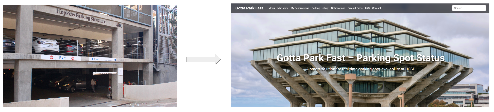
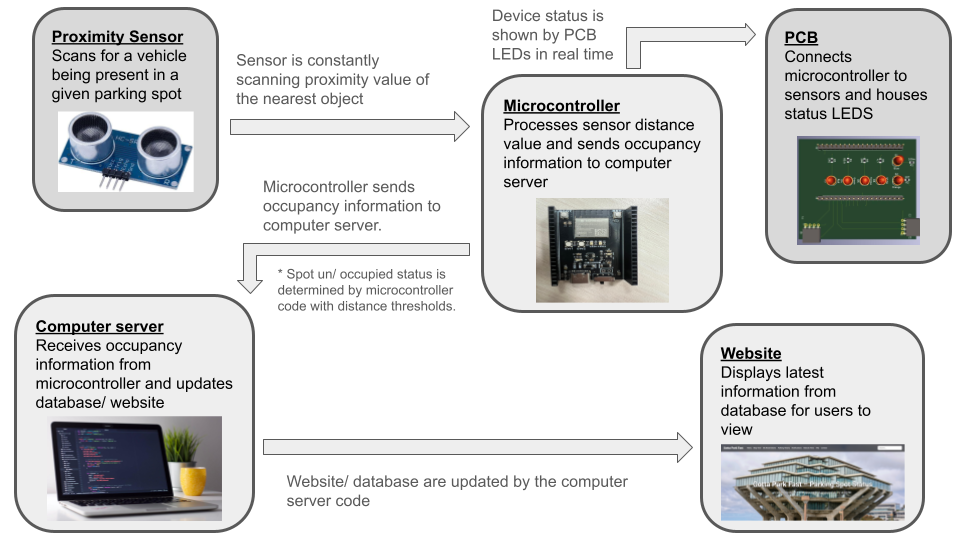

<link href="https://fonts.googleapis.com/css2?family=Roboto&display=swap" rel="stylesheet">

<nav style="background-color: rgb(205, 243, 225); padding: 1em;">
  <a href="/ECE196_team10/" style="color:#000; margin-right: 15px; text-decoration: underline;">Home</a>
  <a href="/ECE196_team10/problem" style="color:#000; margin-right: 15px; text-decoration: underline;">The Problem</a>
  <a href="/ECE196_team10/solution" style="color: #000; margin-right: 15px; text-decoration: underline;">Our Solution</a>
  <a href="/ECE196_team10/milestones_progress" style="color:#000; margin-right: 15px; text-decoration: underline;"> Milestones and Progress </a>
  <a href="/ECE196_team10/pcb" style="color:#000;margin-right: 15px;  text-decoration: underline;">Our PCB</a>
  <a href="/ECE196_team10/team" style="color:#000; margin-right: 15px; text-decoration: underline;">About Us</a>
  <a href="/ECE196_team10/application_website_GPF/index.html" style="color:#000; margin-right: 15px; text-decoration: underline;">Our Application</a>
</nav>

# Our Solution

## Description

Currently, we have identified two key concerns with the current student experience of parking on campus: **Information Distribution** and **Data Collection**

#### Information Distribution
Students are currently limited to basing their knowledge of current parking on the historical data from the first two weeks of the quarter. <u> We propose a website which displays the current availability of parking spots with realtime or near-relatime update frequency </u>. This information can be viewed from anywhere and doesn't require the usage of a phone, improving accessibility and student planning ability.

#### Data Collection
<u>To more reliably collect information for the website, we propose the deployment of per-parking-spot occupancy detection devices.</u> These consist of a microcontroller and ultrasonic sensor, which are connected and indicate status via our team's PCB. The device will detect if a vehicle is present and communicate this is a computer or other server device which updates the website for students to view. For students actively inside the parking structure, indicator lights are also present, showing if a spot is occupied and what type of spot it is.

## Technology Block Diagram

