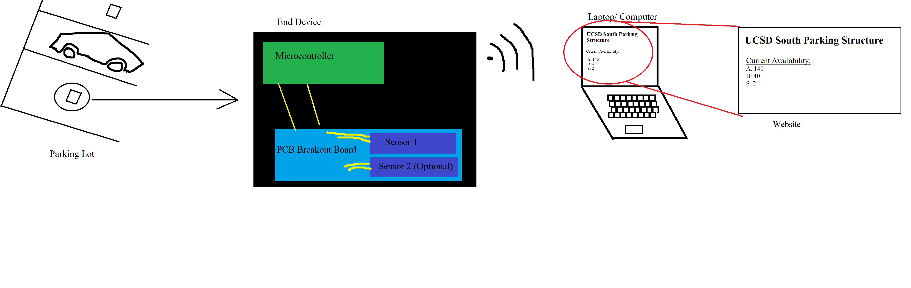
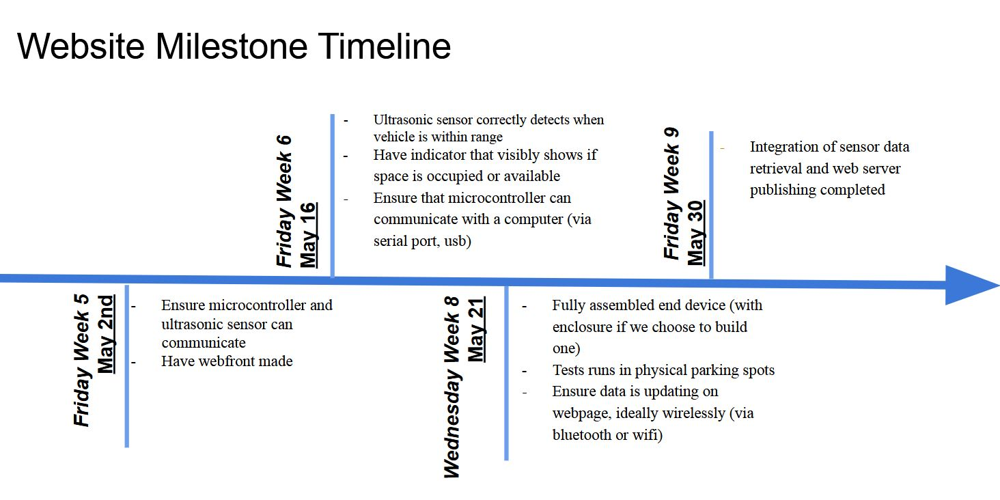
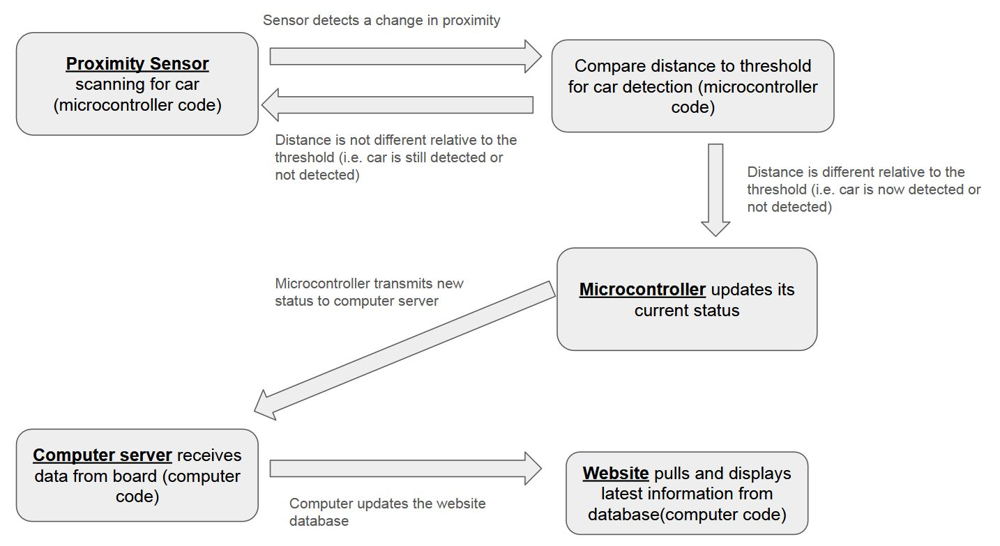

# Our Solution

### Description
- The solution involves the usage of a proximity sensor, which detects a car being present, communicating to a microcontroller. 
- This microcontroller communicates parking data to a host computer
- The computer can then update the website with accurate parking information.

### Technology Highlights
\* Key technological usage in the project includes:
- Proximity sensor/ wiring
- Microcontroller 
  - Wiring
  - Programming to interpret sensor data
  - Programming to communicate with computer server
- Program design
  - Code to interpret microcontroller communication
  - Code to update website
- Website
  - Webfront
  - Database to pull parking data from

## Our Milestones

## Technology Block Diagram
