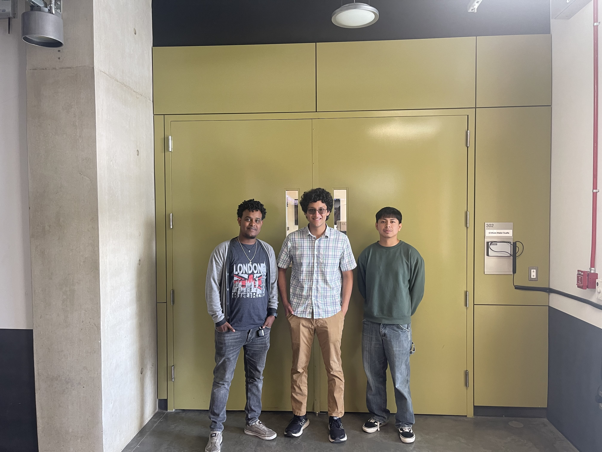

<link href="https://fonts.googleapis.com/css2?family=Roboto&display=swap" rel="stylesheet">

<nav style="background-color: white; padding: 1em;">
  <a href="/ECE196_team10/" style="color:#000; margin-right: 15px; text-decoration: underline;">Home</a>
  <a href="/ECE196_team10/problem" style="color:#000; margin-right: 15px; text-decoration: underline;">The Problem</a>
  <a href="/ECE196_team10/solution" style="color: #000; margin-right: 15px; text-decoration: underline;">Our Solution</a>
  <a href="/ECE196_team10/milestones_progress" style="color:#000; margin-right: 15px; text-decoration: underline;"> Milestones and Progress </a>
  <a href="/ECE196_team10/pcb" style="color:#000;margin-right: 15px;  text-decoration: underline;">Our PCB</a>
  <a href="/ECE196_team10/team" style="color:#000; margin-right: 15px; text-decoration: underline;">About Us</a>
</nav>

# Meet the Team

Aron Bariagabr (Left), Aatash Pestonjamasp (Middle), Fernando Salgado (Right)

This project is being developed as part of our ECE 196: Engineering Hands-on Group Project course at UCSD. 

